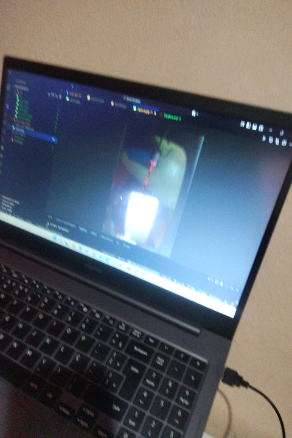

# Aplicativo de Segurança com Sensor de Proximidade

Este projeto é um aplicativo Android desenvolvido em Flutter que utiliza o sensor de proximidade para ativar um modo de segurança. Ao detectar movimento próximo, o app dispara um alerta continuo, captura uma foto com a câmera frontal e a envia para um servidor Python via comunicação TCP/IP.

## 📌 Funcionalidades
- Monitoramento contínuo do sensor de proximidade
- Captura automática de imagem ao detectar proximidade
- Envio da imagem para o servidor via TCP/IP

## 🚀 Instalação e Execução

### 🔹 Servidor (Python)
1. Instale as dependências necessárias:
   ```bash
   pip install os tkinter threading pygame socket base64
   ```
2. Execute o servidor no computador:
   ```bash
   python server.py
   ```

### 🔹 Aplicativo Flutter (Android)
1. Instale o Flutter e o Dart no seu ambiente de desenvolvimento, instale o SDK do android e monitore se todos os itens estão no seu pc com o "flutter doctor"
2. Clone este repositório e entre na pasta do projeto:
   ```bash
   git clone https://github.com/Luizfelipenog/SensorInvasao.git
   cd SensorInvasao
   ```
3. Instale as dependências do projeto:
   ```bash
   flutter pub get
   ```
4. Conecte um dispositivo Android via USB ou emulador, ou se preferir, gere um apk com: "flutter build apk --split-per-abi"
5. Execute o aplicativo:
   ```bash
   Direto no seu smartphone
   ```

## 🛠 Estrutura do Código

- `main.dart`: Código principal do app Flutter
  - Conecta-se ao servidor via TCP/IP
  - Monitora o sensor de proximidade
  - Captura e envia imagens automaticamente
- `server.py`: Servidor Python
  - Recebe e processa as imagens enviadas pelo app
  - Emite um alerta sonoro quando recebe uma imagem
- `alarm-no3-14864.mp3: Som de alarme para alerta`: Alarme usado
- `pubspec.yaml`: Dependências do Flutter
- `.gitignore`: Arquivos ignorados pelo Git
- `test_create_flutter`: Pasta principal do projeto Flutter
  - Contém os arquivos do app, incluindo o código-fonte e dependências

## 📸 Capturas de Tela





## 📖 Explicação do Funcionamento
1. O app monitora continuamente o sensor de proximidade.
2. Quando detecta um objeto próximo, dispara um alerta e captura uma imagem.
3. A imagem é codificada em Base64 e enviada via TCP/IP para o servidor.
4. O servidor recebe a imagem, e a baixa na pasta local do notebook,o seravidor ainda exibe em uma interface Tkinter um botão de parar o alarme.
5. O servidor responde ao app confirmando a recepção da imagem.

## 📜 Licença
Este projeto está sob a licença MIT. Sinta-se livre para modificar e aprimorar conforme necessário!

